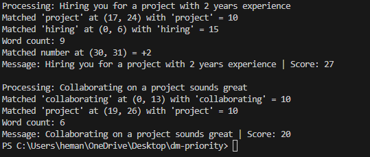

# DM-Priority Tool

A Python-based tool to help prioritize and organize LinkedIn direct messages (DMs) efficiently. Designed for users receiving 50-150 messages weekly, it separates genuine outreach (e.g., job offers with resumes or project links) from noise (e.g., sales pitches or casual "how are you" messages).

## Problem Statement

User receive 50-150 LinkedIn messages per week. Some are generic sales pitches or casual greetings, while others are valuable, containing detailed proposals, resumes, or project links. Manually sorting through them is time-consuming. This tool aims to automate prioritization and organization of these DMs.

## Goals

- Intuitive User Experience: Simple setup and clear output (e.g., prioritized message lists).
- Key Features:
   : Classify messages into categories (e.g., "Genuine," "Sales," "Casual").
   : Prioritize based on content (e.g., keywords like "resume," "project" or links).
   : Optional settings to auto-filter or flag spammy connections.
- User Privacy: Local processing by default; optional API key integration (e.g., OpenAI/Claude) for advanced analysis.
- Code Quality: Modular, extensible design with clear variable names and atomic functions.
- Proper Git Workflow: Regular, descriptive commits on GitHub.

## Tech Stack

- Python: Core language for scripting and logic. 
- re: Regular expressions for basic text pattern matching.

## Progressive Results

- Initial Keyword scoring

- Added Bonuses and Penalty
